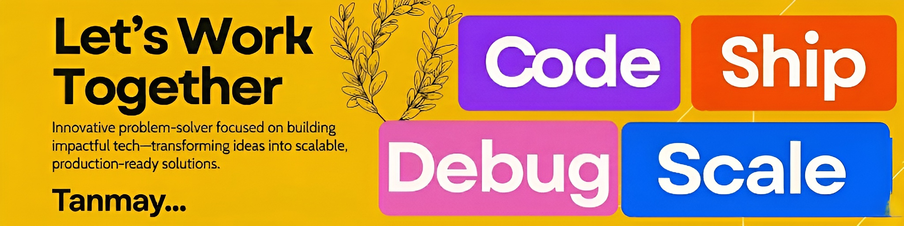

  

# 👩‍💻 About Me

- 🎓 BSc in Computer Science and Data Analytics, Indian Institute of Technology, Patna (CPI: 7.8/7.4/8.4)
- 🎓 BTech in Computer Science and Engineering, Sheat College of Engineering, Varanasi (CGPA: 7.6/7.2/7.3/6.8/7.5)

   

<!-- <h2 align="left">⚡ Tech Stack</h2> -->
# 💻 Tech Stack:
###

<h3>💻 Languages</h3>

  
  
  
  
  
  
  

<h3>🎨 Frontend</h3>

  
  
  
  
  

<h3>⚙️ Backend</h3>

  
  
  

<h3>☁️ Cloud & IoT</h3>

  
  
  
  
  

<h3>🗄️ Database</h3>

  
  
  

<h3>🛠️ Tools & Platforms</h3>

  
  
  
  
  
  
  

 

<picture>
  <source
    media="(prefers-color-scheme: dark)"
    srcset="https://raw.githubusercontent.com/Rashmi000Rashmi/Rashmi000Rashmi/output/github-snake-dark.svg"
  />
  <source
    media="(prefers-color-scheme: light)"
    srcset="https://raw.githubusercontent.com/Rashmi000Rashmi/Rashmi000Rashmi/output/github-snake.svg"
  />
  
</picture>

 

# 📫 Get in Touch

- 📧 Email: baranwaltanmay16@gmail.com

- 🔗 [LinkedIn](https://www.linkedin.com/in/iamtanmaybaranwal/)
 
